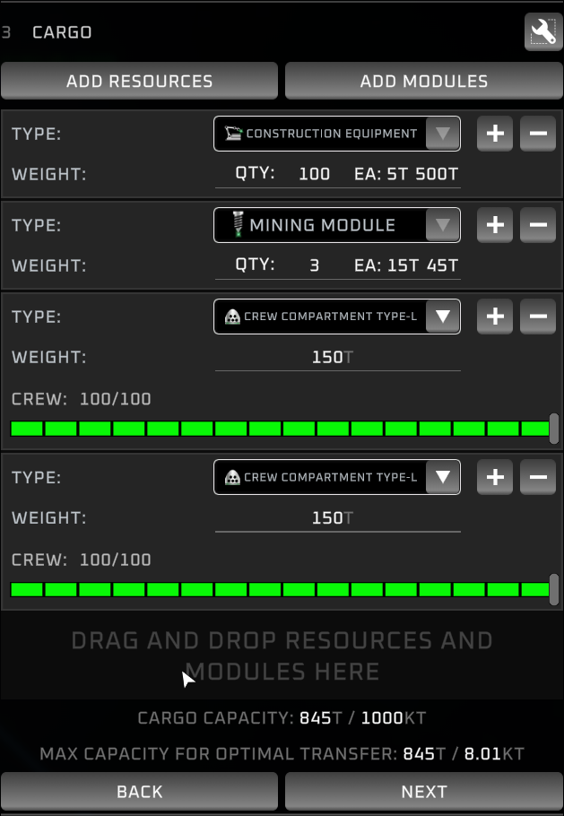
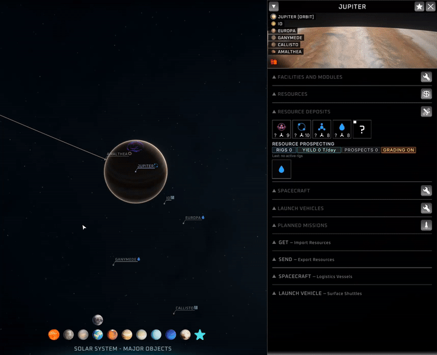
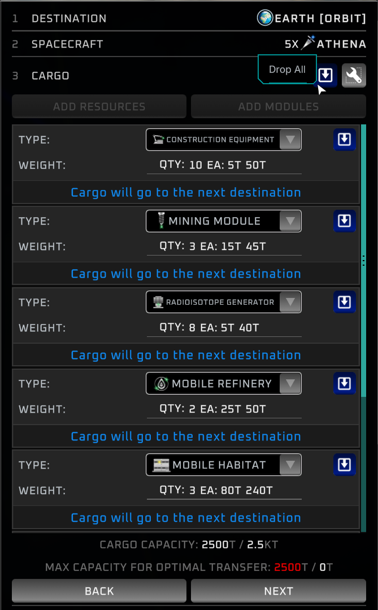
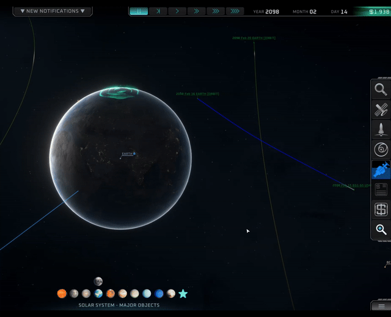

# QoLarExpanse

A grab-bag of quality-of-life fixes for Solar Expanse: jump around the solar system with hotkeys, open any screen with one key, and tame the cargo panel, all without changing how the game actually plays.

<table>
<tr>
<td width="50%"></td>
<td width="50%"></td>
</tr>
</table>

## What it does

- **Solar-system navigation.** Step between planets in distance-from-sun order and between a planet's moons with Ctrl + arrow keys, favorited bodies included as extra stops. Ctrl-click a body to snap between its surface and orbital view. Dragging behaves the same everywhere, too: whether you pick something up from the bottom nav bar or from a 3D body in the view, holding Ctrl while you drag cargo onto a body drops it into that body's orbit.

<!-- TODO: video, paste the GitHub user-attachments URL for qol-orbital-click-and-toggle.mp4 (11s, click-to-play) on its own line here -->

- **One-key screens.** F4 through F7 open Search, Missions, Market, and Research directly; with a body selected, Missions and Market open for that body. The arrow keys also stop nudging the map while you type or have a screen open, so a shortcut or a stray letter won't drag the camera by accident.

<!-- TODO: video, paste the GitHub user-attachments URL for qol-screen-hotkeys.mp4 (14s, click-to-play) on its own line here -->

- **Mission-planning shortcuts.** Inside the Plan Mission window, toggle origin or destination between surface and orbit, swap them, and step back and forward, all from the keyboard. The mnemonic: A is your point A (origin), D is your destination, and S, sitting between them, swaps the two.

<!-- TODO: video, paste the GitHub user-attachments URL for qol-mission-planning-and-search.mp4 (39s, click-to-play) on its own line here -->

- **Quick save and load.** One key writes a fresh save, another reloads your most recent one, with an on-screen confirmation.
- **Calmer contract loading.** Loading a save full of contracts no longer spams a popup and a sound for every restored contract.
- **A tidier cargo panel.** Identical modules collapse into one row with a quantity you can edit directly, a Drop All button clears leftover cargo in one click, and every module row stays editable so you can add or swap any module whenever you like.

<table>
<tr>
<td width="50%"></td>
<td width="50%"></td>
</tr>
</table>

## Hotkeys

| Keys | What it does | Where it works |
|-|-|-|
| Ctrl + Left / Right | Previous / next planet, ordered by distance from the sun | System map |
| Ctrl + Up / Down | Next / previous moon of the current planet | With a planet selected |
| Ctrl + Click | Jump a body between its surface and orbital view | On a body's surface panel or its quick-access icon |
| Ctrl + Drag | Drop the item into a body's orbit instead of onto its surface | While dragging onto a body that has an orbit |
| Tab | Flip the open info window between surface and orbit | While a body info window is open |
| F4 / F5 / F6 / F7 | Open Search / Missions / Market / Research | Anywhere; F5 and F6 open for the selected body if one is picked |
| F11 / F12 | Quick save to a new file / quick load the most recent save | In-game |
| Alt + A / Alt + D | Toggle mission origin / destination between surface and orbit (A/S/D: point A, swap, destination) | Plan Mission window open |
| Alt + S | Swap mission origin and destination | Plan Mission window open |
| Backspace / Enter | Step back / forward through Plan Mission (Enter confirms on the last step) | Plan Mission window open |
| Up / Down, then Enter | Move through a search suggestion list and pick the highlighted result | Search suggestion dropdown open |

Every key here is configurable, see the settings file below.

## Configuration

Settings live in `BepInEx/config/marr75.solarexpanse.qolarexpanse.cfg` and can also be edited live in-game if you have the Configuration Manager mod installed. The ones worth touching:

- **`MasterEnabled`**: the whole-mod off switch.
- **`ModuleStackEnabled`**: turn off if you prefer one row per module.
- **`StopArrowKeysMovingMap`**: turn off if it fights another camera setup.
- **`DeferBottomBarClicksToSimpleTweaks`** (Advanced): only turn on if you also run Simple Tweaks and its quick-access-bar Ctrl-click jumps to orbit twice; Ctrl-clicking bodies in the main view is unaffected either way.

Everything else is a feature on/off toggle or a rebindable key, grouped by section in the file.

## Requirements

- Solar Expanse + BepInEx 5 (Mono/x64).

## Install

1. Install BepInEx 5.
2. Drop the `QoLarExpanse` folder into `BepInEx/plugins/`.

## Building (developers)

`dotnet build` deploys the DLL to the game's plugins folder via the post-build target. See `AGENTS.md`.
